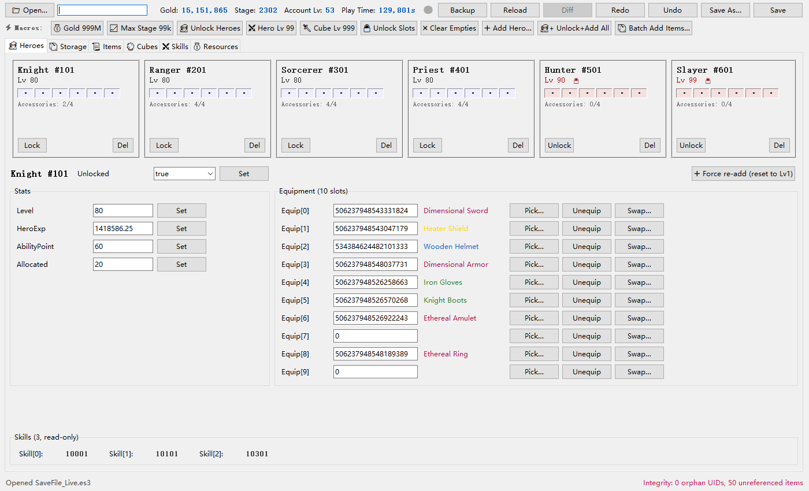

# Taskbar Hero Save Editor

Tkinter desktop application for browsing and editing **Taskbar Hero** (Tesseract Studio) save files. The game uses **ES3** (Easy Save 3) format — AES-128-CBC encrypted JSON with PBKDF2 key derivation and HMAC-SHA256 integrity verification.

## Quick Start

```bash
pip install pycryptodome demjson3 Pillow
python es3_editor.py
```

The save file auto-loads from the default path (`%AppData%/LocalLow/TesseractStudio/TaskBarHero/SaveFile_Live.es3`). Open a new one via **File → Open**.

## Features

| Tab | What it edits |
|---|---|
| **Heroes** | 6 hero cards — equipment slots, skills, level, XP, lock state |
| **Storage** | Inventory / Stash / Trading slots: UID, ItemKey, IsUnLock toggle |
| **Items** | 129+ item table with search (by key/name), grade filter, EnchantData[6] |
| **Boxes** | Loot box stack management — type, quantity, item reference |
| **Cubes** | Cube recipe unlock status, CubeKey, MaxUnlockRecipeKey |
| **Skills** | Skills / Rune / Pets sub-pages: level, unlock, viewed state |
| **Resources** | Gold, stages, cube level, account level/XP |


**Diff viewer** — tracks every field-level change against a load-time baseline. Compare last edit, all accumulated changes, or diff against a separate file on disk before saving.

## ScreenShot


## Encryption Details

- **Cipher**: AES-128-CBC, key via PBKDF2-HMAC-SHA1 (100 iterations)
- **Password**: `emuMqG3bLYJ938ZDCfieWJ`
- **Integrity**: HMAC-SHA256 over `AccountSaveData|PlayerSaveData|SteamID`
  - Static HMAC key (`bfky`) extracted from `GameAssembly.dll`
- **Persistence**: ES3 writes are appended; a `_REVISION` integer at the tail tracks the write count
